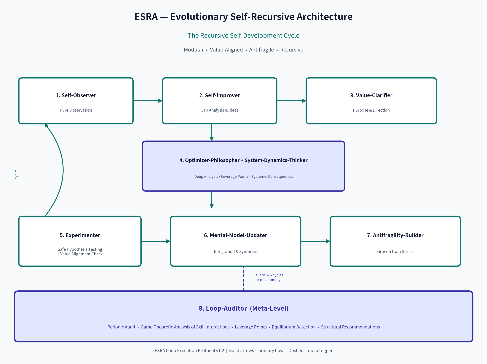

# ESRA — Evolutionary Self-Recursive Architecture

[](https://github.com/rrpauls/esra/actions/workflows/validate.yml)
[](LICENSE)
[](docs/ESRA_Technical_Specification.md)

<p align="center">
  
</p>

<p align="center">
  <strong>The runtime-neutral technical and conceptual specification of ESRA</strong>
</p>

<p align="center">
  Specification, data contracts, conformance tests, and host-pilot gates for auditable agent improvement.
</p>

<p align="center">
  <a href="docs/ESRA_Technical_Specification.md">Technical specification</a> ·
  <a href="docs/ESRA_Loop_Execution_Protocol.md">Loop protocol</a> ·
  <a href="docs/ESRA_Data_Contracts.md">Data contracts</a> ·
  <a href="docs/ESRA_Benchmarking.md">Benchmark</a> ·
  <a href="docs/ESRA_Autonomous_Agent_Profile.md">Autonomous profile</a> ·
  <a href="conformance/compatibility-matrix.json">Compatibility matrix</a> ·
  <a href="https://github.com/rrpauls/esra-agents">Universal implementation</a> ·
  <a href="https://github.com/rrpauls/hermes-esra">Hermes Agent implementation</a> ·
  <a href="https://github.com/rrpauls/chatgpt-esra">OpenAI implementation</a> ·
  <a href="https://github.com/rrpauls/claude-esra">Claude implementation</a> ·
  <a href="LICENSE">Apache-2.0 License</a>
</p>

---

## What is ESRA?

ESRA is a modular, meta-reflective architecture for structuring **deliberate,
long-term, value-aligned improvement** in autonomous agents and human-AI teams.

It turns ad-hoc improvement into a structured, observable, auditable, and self-improving evolutionary process.

Design goal: controlled, value-aligned use and stress should produce observable,
testable improvements rather than assumed self-development.

ESRA is not a claim of phenomenal consciousness or autonomous model learning.
It specifies observable workflows, evidence boundaries, and tests for agent-level
improvement processes without implying changes to model weights.

## Current status

- **Specification:** ESRA 1.2, runtime-neutral and licensed under Apache-2.0.
- **Canonical implementation:**
  [`esra-agents`](https://github.com/rrpauls/esra-agents), with the autonomous
  OpenClaw profile released as
  [`v0.2.0` prerelease](https://github.com/rrpauls/esra-agents/releases/tag/v0.2.0).
- **Exporter conformance:** 24/24 benchmark cases pass across the four declared
  implementations, with zero schema errors and zero privacy violations.
- **Native host maturity:** still evidence-gated. Package validation and exporter
  conformance do not by themselves prove lifecycle behavior in every host.

See the [benchmark methodology](docs/ESRA_Benchmarking.md),
[compatibility matrix](conformance/compatibility-matrix.json), and
[Host Pilot Protocol](docs/ESRA_Host_Pilot_Protocol.md) for the exact claim boundaries.

---

## Core Documents

| Document | Description |
|----------|-------------|
| [ESRA_Technical_Specification.md](docs/ESRA_Technical_Specification.md) | Vision, principles, 8-level architecture, skill contracts, control flow, observability, safety |
| [ESRA_Loop_Execution_Protocol.md](docs/ESRA_Loop_Execution_Protocol.md) | Detailed 8-stage cycle, types of cycles, rules, and constraints |
| [ESRA_Data_Contracts.md](docs/ESRA_Data_Contracts.md) | Versioned JSON contracts and implementation capability declarations |
| [compatibility-matrix.json](conformance/compatibility-matrix.json) | Machine-readable exporter coverage across current implementations |
| [ESRA_Benchmarking.md](docs/ESRA_Benchmarking.md) | Reproducible exporter-conformance benchmark and interpretation boundaries |
| [ESRA_Host_Pilot_Protocol.md](docs/ESRA_Host_Pilot_Protocol.md) | Controlled cross-host behavior pilot with evidence requirements |
| [ESRA_Autonomous_Agent_Profile.md](docs/ESRA_Autonomous_Agent_Profile.md) | Guarded autonomous evolution lifecycle and ten-scenario host gate |

---

## The 8 Levels (Summary)

| Level | Name                        | Key Skill(s)                          | Role |
|-------|-----------------------------|---------------------------------------|------|
| 0     | Runtime                     | Runtime Agent                         | Execution |
| 1     | Reflective                  | Self-Observer                         | Observation |
| 2     | Value-oriented              | Value-Clarifier                       | Alignment |
| 3     | Deep Analysis               | Optimizer-Philosopher + System-Dynamics-Thinker | Consequences |
| 4     | Experimental                | Experimenter                          | Safe testing |
| 5     | Integrative                 | Mental-Model-Updater                  | Integration |
| 6     | Antifragile                 | Antifragility-Builder                 | Strength from stress |
| 7     | Meta                        | Loop-Auditor                          | Evolution of the architecture itself |

---

## The ESRA Loop



The protocol defines a cycle of observation, improvement, value alignment, deep
analysis, safe experimentation, integration, and resilience learning. The
**Loop-Auditor** operates at the meta-level, reviewing recorded cycles on a
configured cadence or after an anomaly.

Full stage definitions, inputs/outputs, cycle variants and rules are specified in the [Loop Execution Protocol](docs/ESRA_Loop_Execution_Protocol.md).

---

## Design Principles

- **Modularity** — every skill is an independent, versionable component
- **Meta-level** — the system can observe and improve its own improvement process
- **Value Alignment** — non-negotiable gate before significant actions
- **Antifragility as a hypothesis** — gains from controlled stress and failure must be demonstrated
- **Observability & Auditability** — everything is loggable and inspectable
- **Recursivity** — the architecture improves itself through its own loops

---

## Relationship to Implementations

This repository (`esra`) describes **what** the architecture is.

The canonical cross-host implementation is:

- **[esra-agents](https://github.com/rrpauls/esra-agents)** — one portable Agent Skills catalog and shared runtime with thin adapters for ChatGPT/Codex, Claude Code, and Hermes Agent; use its tagged releases for new installations

The earlier host repositories remain available during migration and retain
their existing release URLs:

- **[hermes-esra](https://github.com/rrpauls/hermes-esra)** — legacy Hermes skills and integration toolkit
- **[chatgpt-esra](https://github.com/rrpauls/chatgpt-esra)** — legacy OpenAI distribution for ChatGPT and Codex
- **[claude-esra](https://github.com/rrpauls/claude-esra)** — legacy Claude Code distribution

---

## How to use this repository

1. Read the Technical Specification for the full conceptual model.
2. Read the Loop Execution Protocol to understand how a single cycle actually runs.
3. Use the Data Contracts and compatibility matrix when implementing or auditing a runtime adapter.
4. Run the exporter benchmark before changing portability claims:

   ```bash
   python3 benchmarks/run.py --implementations-root ..
   ```

5. Use the Host Pilot Protocol before making claims about native host behavior.

## License

Apache-2.0 — see [LICENSE](LICENSE). Attribution is recorded in [NOTICE](NOTICE).

---

**ESRA is a living architecture.**
This repository evolves together with the system it describes.
